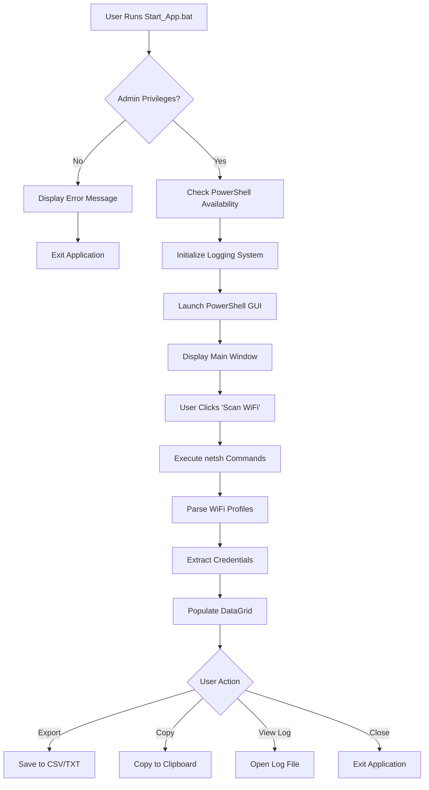
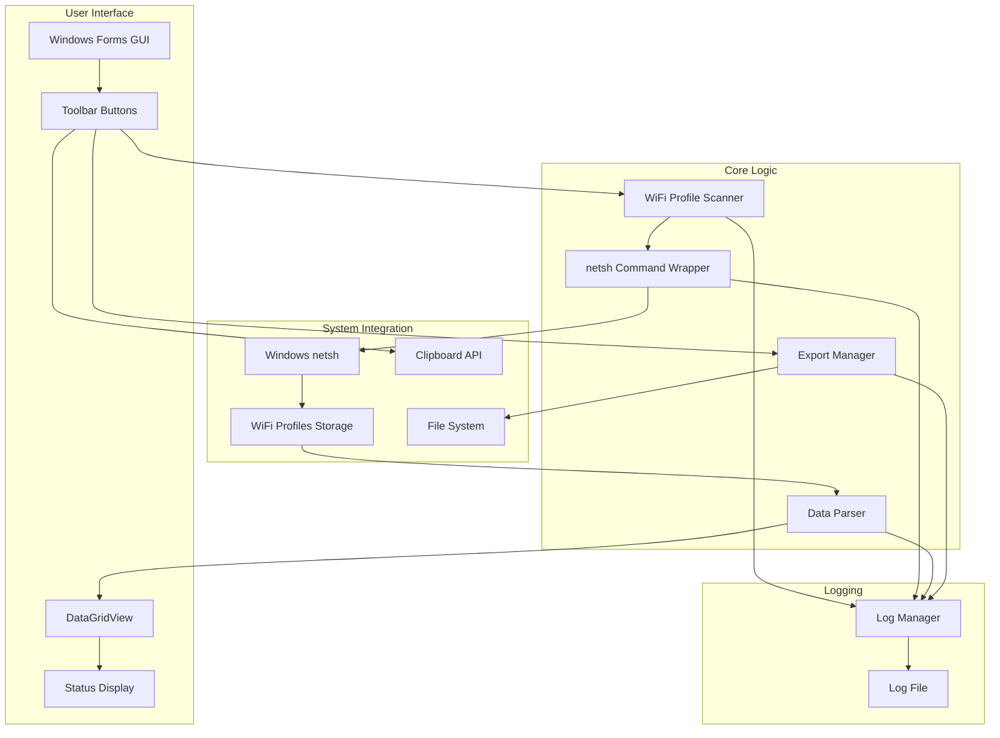

# xsukax WIFI Password Recover

[](https://github.com/xsukax/xsukax-WIFI-Password-Recover)
[](LICENSE)
[]()
[]()

A professional, open-source WiFi password recovery tool for Windows that retrieves and displays saved wireless network credentials through an intuitive graphical user interface.

## 📋 Project Overview

**xsukax WIFI Password Recover** is a comprehensive Windows application designed to help users retrieve forgotten WiFi passwords stored on their local system. Built with PowerShell and Windows Forms, this tool provides a clean, modern interface for accessing saved wireless network profiles and their associated credentials.

The application leverages Windows' native `netsh` commands to extract WiFi profile information, presenting it in an organized, user-friendly format. Whether you need to recover a lost password, document your network configurations, or transfer credentials to a new device, this tool simplifies the entire process.

### Primary Functionalities

- **Profile Discovery**: Automatically scans and retrieves all saved WiFi profiles on the system
- **Credential Recovery**: Displays network passwords that would otherwise be hidden in Windows settings
- **Data Export**: Exports recovered credentials to CSV or TXT formats for backup and documentation
- **Clipboard Integration**: Quick-copy functionality for individual passwords or complete profile information
- **Comprehensive Logging**: Maintains detailed logs of all operations for troubleshooting and audit purposes
- **Modern GUI**: Professional Windows Forms interface with intuitive controls and visual feedback

## 🔒 Security and Privacy Benefits

This application is designed with security and privacy as foundational principles, ensuring that users maintain complete control over their sensitive network credentials.

### Local-Only Operation

All WiFi credential recovery operations are performed entirely on the local machine. The application does not transmit any data over networks, upload information to external servers, or communicate with third-party services. Your network passwords never leave your computer unless you explicitly choose to export them.

### Administrator Privilege Requirement

The application enforces strict administrator privilege verification before execution. This Windows security measure ensures that only authorized users with administrative rights can access saved WiFi credentials, preventing unauthorized access by standard user accounts or malicious software running with limited privileges.

### Transparent Audit Trail

Every operation performed by the application is logged to `xsukax_WIFI_Recover_Log.txt` with timestamps, providing complete transparency and accountability. This comprehensive logging enables users to review exactly what actions were taken and when, supporting security audits and troubleshooting efforts.

### Open Source Transparency

As an open-source project, the complete source code is available for public inspection, security auditing, and community review. Users and security professionals can verify that the application performs only the stated functions without hidden behaviors, backdoors, or malicious code.

### User Data Control

Users retain full control over exported data. The application never creates automatic backups to cloud services or hidden locations. All export operations require explicit user consent through standard Windows file dialogs, allowing users to choose exactly where and how their credentials are stored.

### No External Dependencies

The application relies solely on built-in Windows components (PowerShell, .NET Framework, and netsh), eliminating risks associated with third-party libraries or external executables that could introduce vulnerabilities or privacy concerns.

## ✨ Features and Advantages

### Core Features

- **One-Click Scanning**: Retrieve all saved WiFi profiles with a single button click
- **Comprehensive Profile Information**: Displays SSID, password, authentication type, and encryption method for each network
- **Advanced Filtering**: Real-time search and filter capabilities across all profile fields
- **Multi-Format Export**: Save recovered data as CSV for spreadsheet analysis or TXT for human-readable documentation
- **Smart Copy Functions**: Double-click any password to instantly copy it to the clipboard
- **Visual Indicators**: Color-coded password display distinguishing between available credentials and open networks
- **Progress Feedback**: Real-time status updates during scanning operations
- **Error Handling**: Robust error detection and user-friendly error messages

### Key Advantages

**Ease of Use**: Unlike command-line alternatives, the GUI provides immediate visual access to all information without memorizing complex commands or syntax.

**Time Efficiency**: Batch retrieval of all WiFi profiles eliminates the need to query networks individually, dramatically reducing time spent recovering multiple passwords.

**Professional Quality**: Built with enterprise-grade error handling, logging, and user experience design principles typically found in commercial software.

**No Installation Required**: Portable application that runs directly without installation, registry modifications, or system changes.

**Comprehensive Documentation**: Every function is thoroughly logged, and the source code includes detailed comments for developers and advanced users.

**Cross-Version Compatibility**: Fully compatible with Windows 10 and Windows 11, supporting both legacy and modern WiFi security protocols.

**Safe and Reliable**: Uses official Windows APIs and commands, ensuring compatibility with Windows security policies and avoiding system modifications that could compromise stability.

## 📦 Installation Instructions

### System Requirements

- **Operating System**: Windows 10 or Windows 11
- **PowerShell**: Version 5.0 or higher (pre-installed on Windows 10/11)
- **.NET Framework**: Version 4.5 or higher (pre-installed on Windows 10/11)
- **Privileges**: Administrator access to the system
- **WiFi Adapter**: Active WiFi adapter (can be disabled, but must be present)

### Installation Steps

1. **Download the Repository**
   
   Navigate to the GitHub repository and download the latest release:
   ```
   https://github.com/xsukax/xsukax-WIFI-Password-Recover
   ```
   
   Click the green "Code" button and select "Download ZIP", or clone the repository using Git:
   ```bash
   git clone https://github.com/xsukax/xsukax-WIFI-Password-Recover.git
   ```

2. **Extract the Files**
   
   If you downloaded a ZIP file, extract it to a location of your choice. Ensure both files remain in the same directory:
   - `Start_App.bat`
   - `xsukax_WIFI_Password_Recover.ps1`

3. **Verify File Integrity**
   
   Confirm that both files are present in the same folder. The batch launcher requires the PowerShell script to be located in the same directory.

4. **PowerShell Execution Policy** (If Needed)
   
   Windows may restrict PowerShell script execution by default. If you encounter execution policy errors, you can temporarily allow script execution by running PowerShell as Administrator and executing:
   ```powershell
   Set-ExecutionPolicy -ExecutionPolicy Bypass -Scope Process
   ```
   
   Note: The `Start_App.bat` launcher handles this automatically using the `-ExecutionPolicy Bypass` parameter.

### No Additional Installation Required

The application is completely portable and requires no installation process, registry modifications, or system configuration changes. It can be run directly from any location, including USB drives or network shares.

## 🚀 Usage Guide

### Launching the Application

1. **Locate the Files**
   
   Navigate to the folder containing `Start_App.bat` and `xsukax_WIFI_Password_Recover.ps1`.

2. **Run as Administrator**
   
   Right-click on `Start_App.bat` and select **"Run as administrator"**. This is mandatory as WiFi credential access requires elevated privileges.
   
   Alternatively, you can directly run `xsukax_WIFI_Password_Recover.ps1` by right-clicking it, selecting "Run with PowerShell", and confirming the UAC prompt.

3. **Confirm UAC Prompt**
   
   Windows will display a User Account Control prompt. Click **"Yes"** to grant administrator privileges.

### Application Workflow



### Main Interface Operations

#### Scanning WiFi Profiles

1. Click the **"Scan WiFi"** button in the toolbar
2. The application will display real-time progress as it processes each profile
3. Upon completion, all discovered networks appear in the data grid
4. The status bar displays the total number of profiles found

#### Viewing Profile Information

The data grid displays four columns for each WiFi profile:

- **WiFi Network (SSID)**: The network name
- **Password**: The saved password (displayed as "N/A" for open networks)
- **Authentication**: Security protocol (e.g., WPA2-Personal, WPA3-SAE)
- **Encryption**: Cipher type (e.g., AES, CCMP)

Passwords are displayed in **bold green text** when available, and in *italic gray* for open networks.

#### Copying Credentials

**Method 1 - Quick Copy Password**:
- Double-click any row to instantly copy that network's password to the clipboard

**Method 2 - Copy Full Profile**:
- Select a row by clicking it once
- Click the **"Copy Selected"** button
- The complete profile information (SSID, password, authentication, encryption) is copied to the clipboard

#### Exporting Data

1. Click the **"Export Data"** button
2. Choose your preferred format:
   - **CSV**: For importing into Excel or other spreadsheet applications
   - **TXT**: For human-readable documentation
3. Select a save location and filename
4. Click "Save" to export all recovered profiles

#### Viewing Logs

Click the **"View Log"** button to open the comprehensive log file (`xsukax_WIFI_Recover_Log.txt`) in Notepad. The log contains:
- Session start/end timestamps
- System information
- All operations performed
- Error messages and warnings
- Profile retrieval details

### System Architecture



### Troubleshooting Common Issues

**Application Won't Start**
- Ensure you're running as Administrator
- Verify PowerShell 5.0+ is installed
- Check that both `.bat` and `.ps1` files are in the same directory

**No Profiles Found**
- Ensure WiFi adapter is present (it doesn't need to be enabled)
- Verify you have connected to WiFi networks on this computer before
- Check that the netsh command is not blocked by security software

**Export Fails**
- Ensure you have write permissions to the selected directory
- Verify sufficient disk space is available
- Try exporting to a different location

**Passwords Show as "N/A"**
- Some networks may be open (no password required)
- Passwords may not have been saved (forgot to check "Connect automatically")
- Very old profiles might have incomplete information

## 📄 Licensing Information

This project is licensed under the GNU General Public License v3.0.

## 🤝 Contributing

Contributions, issues, and feature requests are welcome! Feel free to check the [issues page](https://github.com/xsukax/xsukax-WIFI-Password-Recover/issues) on GitHub.

## 👤 Author

**xsukax**

- GitHub: [@xsukax](https://github.com/xsukax)
- Repository: [xsukax-WIFI-Password-Recover](https://github.com/xsukax/xsukax-WIFI-Password-Recover)

## ⚠️ Legal Disclaimer

This tool is intended for legitimate password recovery on systems you own or have explicit authorization to access. Unauthorized access to computer systems or networks is illegal. Users are responsible for ensuring their use of this software complies with all applicable laws and regulations.

## 📝 Version History

### Version 2.0.1 (Current)
- Professional Windows Forms GUI interface
- Enhanced error handling and logging
- Multi-format export functionality
- Improved user experience with visual feedback
- Comprehensive status updates during operations

---

**Note**: This application requires Windows 10 or 11 with an active WiFi adapter. It uses standard Windows commands and APIs to retrieve locally stored credentials and does not perform any network attacks or unauthorized access attempts.
